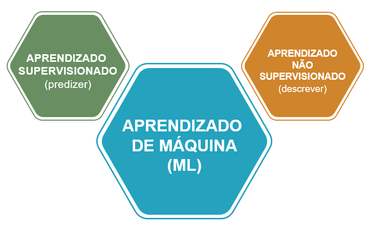
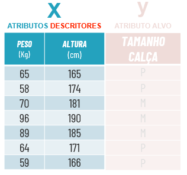
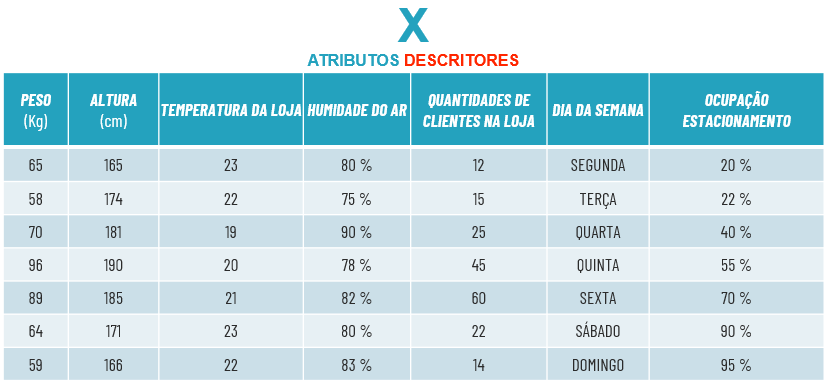
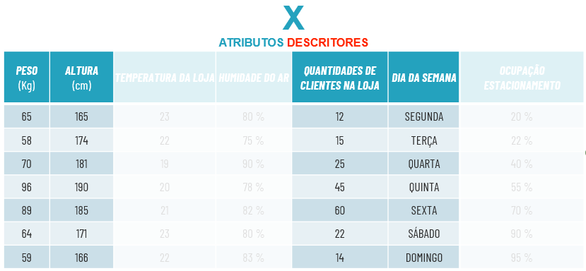
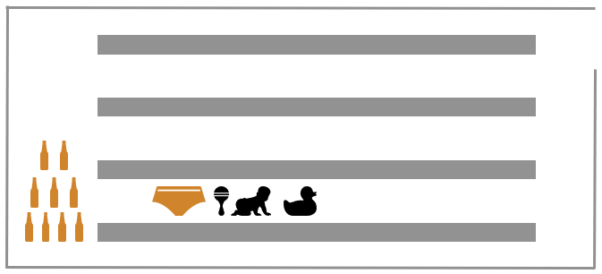
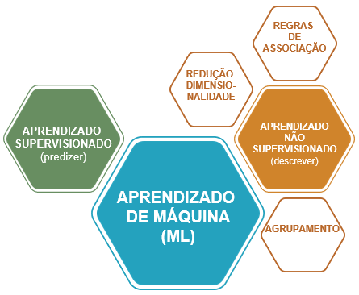
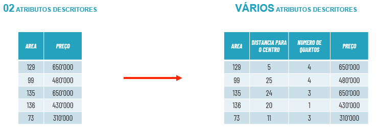

Aprendizado não supervisionado
****

01.O que é aprendizado não supervisionado
====

Diferente do aprendizado supervisionado, no aprendizado não supervisionado **não** se trabalha com atributo alvo, ou seja, não tem uma classe para predizer. 

Dessa forma é possível que se possa entender e descrever os dados, entender a relação entre eles e tirar insghts poderosos.

02.Redução de dimensionalidade
====

Uma tarefa importante do aprendizado não supervisionado é a **redução de dimensionalidade**, ela é preciosa para entender quais atributos descritores são significativos.

É comum no dia a dia de um cientista de dados trabalhar com bases que possuem mais de cem atributos descritores, porém nem todos são relevantes. 
Isso acaba impactando na assertividade do modelo de ML. 

Para isso, utilizamos algumas ferramentas na etapa de preparação dos dados para entender a relevância e reduzir os atributos descritores.

Imagine que você possui um Data Frame de uma loja de roupa com sete atributos descritores, ou seja, sete colunas.

Ao colocar esse Data Frame em um gráfico, cada coluna irá representar uma dimensão (2D, 3D, etc), por isso **ao reduzir as colunas, estamos reduzindo as dimensões**. 

Nesse momento é importante entender qual problema de negócio você quer atacar e quais atributos descritores fazem sentido para seu projeto.

Assim, ao reduzir os atributos descritores que não fazem sentido para seu projeto, terá um aumento da acurácia de seu modelo de ML não supervisionado 

03.Regras de associação
====

Regras de associação não é nada mais que ao analisar os dados encontrar regras de relação do tipo **"SE...E...ENTÃO"**. 

Como por exemplo o famoso caso de uma das maiores empresas varejistas dos EUA descobriu em ao analisar seu banco de dados que havia uma relação estatística muito forte do tipo: 

* **SE** é feriado **E** compra fralda **ENTÃO** compra cerveja.

Com essa informação foi possível ao montar o layout de distribuição de produtos colocar a gôndola de cerveja próxima as fraldas, dessa forma tendo um desparo nas vendas.

Essas regras de associação são muito utilizadas por sistemas de recomendação de diversos serviços, e-commerce, streamming de vídeos, músicas, etc:

* **SE** você viu esse filme **ENTÃO** pode gostar desse daqui.

* **SE** você comprou esse produto **ENTÃO** esse pode te atender.

04.Tarefa de agrupamento
====

Uma das tarefas do aprendizado não supervisionado é a de agrupamento, que consiste em descrever os dados **criando grupos** com características similares. 

Por exemplo, imagine uma imobiliária com uma grande base de dados, que após rodar um modelo de agrupamento, separa seus imóveis em 4 grupos (clusters) com características de preço e área similares.

.. only:: html

   .. image:: images/ML_APNS/agrupamento.gif

Dessa forma seria possível os clientes selecionarem quais características buscam em um imóvel e o modelo recomendar imóveis similares.

Neste exemplo utilizamos apenas área e preço para agrupar os imóveis, mas é possível fazer com diversos atributos descritores, desde que eles façam sentido para o seu projeto de ML

