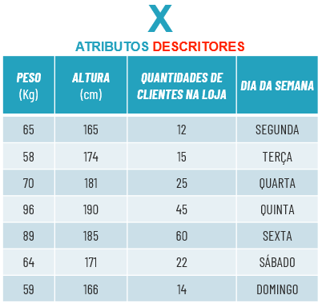
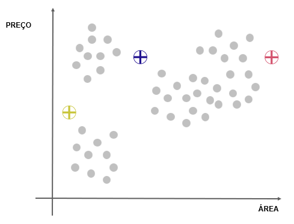

Aprendizado não supervisionado
****

01.O que é aprendizado não supervisionado
====

Diferente do aprendizado supervisionado, no aprendizado não supervisionado **não** se trabalha com atributo alvo, ou seja, não tem uma classe para predizer. 

Dessa forma é possível que se possa entender e descrever os dados, entender a relação entre eles e tirar insghts poderosos.

02.Redução de dimensionalidade
====

Uma tarefa importante do aprendizado não supervisionado é a **redução de dimensionalidade**, ela é preciosa para entender quais atributos descritores são significativos.

É comum no dia a dia de um cientista de dados trabalhar com bases que possuem mais de cem atributos descritores, porém nem todos são relevantes. 
Isso acaba impactando na assertividade do modelo de ML. 

Para isso, utilizamos algumas ferramentas na etapa de preparação dos dados para entender a relevância e reduzir os atributos descritores.

Imagine que você possui um Data Frame de uma loja de roupa com sete atributos descritores, ou seja, sete colunas.

Ao colocar esse Data Frame em um gráfico, cada coluna irá representar uma dimensão (2D, 3D, etc), por isso **ao reduzir as colunas, estamos reduzindo as dimensões**. 

Nesse momento é importante entender qual problema de negócio você quer atacar e quais atributos descritores fazem sentido para seu projeto.

.. image:: images/ML_APNS/data_frame_2.png
   :align: center
   :width: 550

Assim, ao reduzir os atributos descritores que não fazem sentido para seu projeto, terá um aumento da acurácia de seu modelo de ML não supervisionado 

03.Regras de associação
====

Regras de associação não é nada mais que ao analisar os dados encontrar regras de relação do tipo **"SE...E...ENTÃO"**. 

Como por exemplo o famoso caso de uma das maiores empresas varejistas dos EUA descobriu em ao analisar seu banco de dados que havia uma relação estatística muito forte do tipo: 

* **SE** é feriado **E** compra fralda **ENTÃO** compra cerveja.

Com essa informação foi possível ao montar o layout de distribuição de produtos colocar a gôndola de cerveja próxima as fraldas, dessa forma tendo um desparo nas vendas.

Essas regras de associação são muito utilizadas por sistemas de recomendação de diversos serviços, e-commerce, streamming de vídeos, músicas, etc:

* **SE** você viu esse filme **ENTÃO** pode gostar desse daqui.

* **SE** você comprou esse produto **ENTÃO** esse pode te atender.

04.Tarefa de agrupamento
====

.. image:: images/ML_APNS/agrupamento.png
   :align: center
   :width: 550

Uma das tarefas do aprendizado não supervisionado é a de agrupamento, que consiste em descrever os dados **criando grupos** com características similares. 

Por exemplo, imagine uma imobiliária com uma grande base de dados, que após rodar um modelo de agrupamento, separa seus imóveis em 4 grupos (clusters) com características de preço e área similares.

.. only:: html

   .. image:: images/ML_APNS/agrupamento.gif

Dessa forma seria possível os clientes selecionarem quais características buscam em um imóvel e o modelo recomendar imóveis similares.

Neste exemplo utilizamos apenas área e preço para agrupar os imóveis, mas é possível fazer com diversos atributos descritores, desde que eles façam sentido para o seu projeto de ML

   
Dentro da tarefa de agrupamento temos diversos algoritmos sendo esses os mais famosos:

Por hora vamos focar no K-means.

04.a.Algoritmo de aprendizagem K-Means
------

K-Means é um algoritmo de ML que trabalha agrupando os dados a partir das características semelhantes. 

Seu nome, K-**Means** vem por conta que os grupos são formados ao redor das **médias** dos valores daquele grupo. 
Cada uma dessas médias irá formar um **centróide**, que será o centro dos dados de um grupo. Onde **K** representa a quantidade de centróides.

Na prática, imagine que possuímos um gráfico relacionando o preço e a área dos imóveis.

Para criar os grupos, o modelo de ML tirou as médias dos valores que possuiam características semelhantes.

Feito isso, será estabelecido que aquela média será justamente o centróide (centro) do grupo. 

Essa tarefa de tirar a média dos valores dos dados será feita para cada grupo, e a quantidade de grupos (centróides) é representada pela letra **K**.

  

Algumas aplicações de mercado que podemos realizar com a tarefa de agrupamento são:

01.Segmentação de mercado: 

   Ao compreender melhor seus dados e separá-los em grupos, é possível criar uma estratégia de marketing personalizada.

02.Sistema de recomendação:

   Ao possuir grupos que descrevem seus dados, para cada novo usuário que entrar no site será possível identificar suas características e recomendar produtos do grupo que ele pertence.

03.Otimização de rotas:

   Levando em consideração a localização de cada cliente, qual seria o melhor lugar para abrir uma loja, para que o preço e o tempo de frete seja o menor possível

04.Sistema de Machine Learning:

   Outra possível aplicação é utilizar o modelo de agrupamento com outros modelos de ML também, como regressão linear por exemplo. 
   Imagine que ao separar seus dados em grupo você irá treinar um modelo de regressão linear para cada grupo, isso pode aumentar a assertividade de cada modelo. 

04.a.I.Passo a passo
++++

Agora que já entendemos alguns conceitos iniciais do K-Means, vamos nos aprofundar no passo a passo que ele executa para realizar a tarefa de agrupamento:

**1° Passo:** Inicializar os centróides.

- Definir a quantidade de centróides (K) 
  Na hora da programação nós indicamos para o algoritmo qual a quantidade de grupos que desejamos.

- Iniciar os centróides em lugares aleatórios 

**2° Passo:** Associar cada ponto a um centróide

- Calcular a distância de cada ponto até cada centróide

- Associar cada ponto ao centróide mais próximo

.. only:: html

   .. image:: images/ML_APNS/2_passo.gif

**3° Passo:** Reposicionar os centróides

- Para cada *cluster* (grupo), calcular a média do valor para todos os pontos

- Colocar o centróide de cada grupo neste ponto médio

**4° Passo:** Repetir passo 2 e 3

- Com o reposicionamento dos centróides, alguns pontos mudam de grupo. Portanto é necessário repetir o passo dois e o três até que não exista mais a necessidade dessa realocação.

.. only:: html

   .. image:: images/ML_APNS/4_passo.gif

04.a.II.Como definir a melhor quantiade de K (centróides)
++++

Como é necessário indicar para o algoritmo antes da modelagem qual a quantidade de K (grupos) que queremos, existem algumas técnicas.

**1.Compreensão do negócio.**

Uma possível técnica é estabelecer qual a quantidade de grupos que irá trabalhar durante a etapa de compreensão do negócio. 

Por exemplo, no caso de um banco que quer agrupar clientes em adimplentes e inadimplentes, são apenas dois grupos, ou se quer classificar os investimentos em baixo, médio e alto risco, são três grupos. 

**02.Elbow Method**

Elbow Method ou Método Cotovelo consiste em somar as ditâncias que cada ponto tem do seu cluster e colocar em um gráfico.

Imagine que nós desenvolvendo um projeto de ciência de dados para agrupar clientes de um e-commerce e estamos na etapa de descobrir qual a melhor quantidade de K. 

Repare que visualmente falando, já conseguimos notar que a partir de K=4 já não existe uma diferença discrepante entre os grupos. 

E ao somar as distâncias que cada ponto faz do seu cluster e colocarmos em um gráfico, também é possível fazer a mesma análise.

E que justamente onde K=4 a diferença de características entre os grupos passa a diminuir e a reta do gráfico muda de inclinação, formando um "cotovelo", daí que surge o nome *Elbom Method*.

Matematicamente o Método Cotovelo utiliza a soma das distâncias quadráticas dentro dos grupos, que em inglês é representado pela sigla WCSS. O cálculo não é necessário saber realizar, mas o conceito geral. 

04.a.III.Matemática
++++

Matematicamente o algoritmo K-Means é muito parecido com o K-NN, pois realiza cálculos de distâncias. 

Portanto é muito importante **deixar todos os dados em uma mesma escala.** E para isso nós temos duas técnicas, a **normalização** e a **padronização**

.. image:: images/ML_APNS/mesma_escala.png
   :align: center
   :width: 650

Assim como K-Means o K-NN trabalha calculando a distância de um ponto até o outro (que no caso do K-NN será o centróide)

Lembrando que existem diferentes tipos de cálculos de distância, e o melhor cálculo irá depender sempre do seu problema de negócio.

.. image:: images/ML_APNS/tipos_distancia.png
   :align: center
   :width: 550

Além desse conceito matemático o K-Means também trabalha **com a média**, ou seja, para cada *cluster* (grupo) ele calcula a média de todos os pontos e com isso encontra o melhor posicionamento para o centróide.

