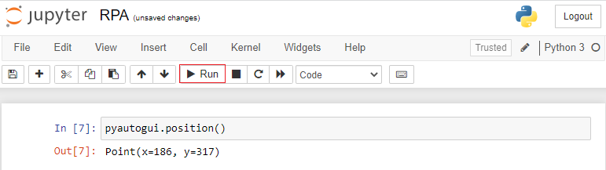
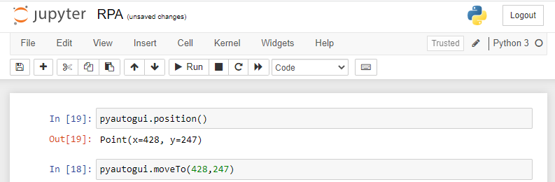
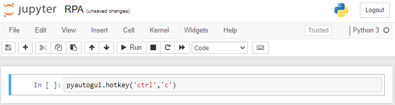
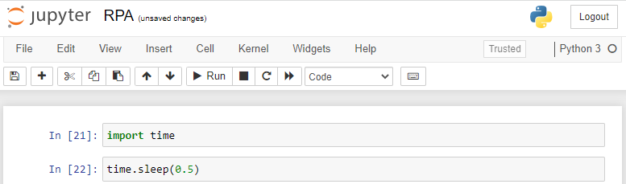

Pyautogui
****

A biblioteca Pyautogui é uma biblioteca da linguagem Python que utiliza recursos da interface gráfica como posição da tela e também recursos como clique do mouse e botões do teclado.

Dessa forma é possível criar tarefas automatizadas com ela, caso queira ler mais sobre existe a documentação original.

https://pyautogui.readthedocs.io/en/latest/

01.Comandos da Pyautogui
====

01.a.pyautogui.Pause
----

o Comando ``pyautogui.PAUSE = tempo_desejado`` estabelece um tempo de espera entre operações.

Para definir qual tempo de espera você deseja, só alterar o *tempo_desejado* por um valor de verdade, como por exemplo ``pyautogui.PAUSE = 0.5``

Esse tempo de espera é importante para o computador não se atropelar em termos de processamento, ou até mesmo para esperar uma janela abrir, etc.

01.b.pyautogui.position()
----

Este comando ``pyautogui.position()`` informa a posição do mouse na tela, é um comando muito importante para descobrir qual o valor que iremos indicar para nosso robô seguir ao clicar em algum ícone. 

Lembrando que a posição do mouse varia para diferentes tamanhos de tela.

01.c.pyautogui.size()
----

Este comando nos informa qual a resolução da tela em altura (y) e largura (x) 

.. image:: images/RPA/size.png
   :align: center
   :width: 650

01.d.pyautogui.press('tecla')
----

Este comando faz com aperte a tecla indicada no teclado, fazendo com que seja possível realizar operações com o teclado. 

01.e.pyautogui.write('texto')
----

Este comando permite a escrita de texto de qualquer tipo, como um e-mail, assunto, login, etc.

01.f.pyautogui.moveTo(x,y)
----

Com este comando podemos mover o cursor do mouse para as posições indicadas, lembrando que com o comando ``pyautogui.position()`` conseguimos descobrir qual a posição desejada.

01.g.pyautogui.click()
----

Este comando faz com que seja dado um click com o botão esquerdo do mouse.
Portanto ao unir o comando ``.moveTo()`` com o ``click()`` podemos mover o cursor do mouse para a localização desejada e realizar o clique do mouse.

01.h.pyautogui.hotkey('tecla_1','tecla_2')
---- 

Este comando nos permite realizar operações de atalho no teclado, como por exemplo copiar ("ctrl + c") e colar ("ctrl + v") 

Basta substituir pelas teclas desejadas. 

01.i.time.sleep(tempo_desejado) 
----

Este não é um comando da biblioteca pyautogui, mas também é muito importante para a execução de tarefas de automação.

Ele é outra forma de definir um tempo de espera entre operações, muito importante para não sobrecarregar o processador do computador, ou para esperar uma página carregar, etc. 

Basta substituir o valor dentro do parênteses pelo tempo de espera desejado

