Detecção de objetos
****

Sabe quando vamos tirar uma foto com o celular e os rostos da foto ficam com um quadrado verde em volta do rosto?
Então, essa é um exemplo de detecção de objetos em uma imagem.

.. note::

   Um objeto é um elemento computacional que representa, no domínio da solução, alguma entidade (abstrata ou concreta).

Para realizar essa detecção de objetos é preciso executar algumas etapas, são elas: 

1. Importar a imagem original 

2. Transformar essa imagem colorida em preto e branco, ou seja, transformar de 3 canais para 1 canal

3. Dar uma "suavizada" na nitidez da imagem, alguns detalhes como bordas, etc, podem atrapalhar o computador no processo de detecção de imagem.

4. Detectar as bordas pela grande diferença de intensidade do pixel

5. Binarizar a imagem, deixar apenas com duas cores, preto e branco.

6. Criar um contorno a partir da borda da imagem binarizada e adicionar em cima da imagem original 

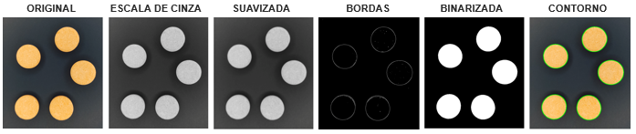

01.Bibliotecas necessárias
====

Para realizar essa tarefa de detecção de objetos vamos importar as bibliotecas necessárias:     
- **OpenCV:** para trabalharmos com imagens.
- **Comando `cv2_imshow( )`:** para mostrarmos a imagem.
- **Numpy:** para trabalharmos com números.
- **Matplotlib:** para trabalhar com gráficos.

.. code-block:: python
   :linenos:

   #Importar as bibliotecas necessárias
   import cv2
   from google.colab.patches import cv2_imshow
   import numpy as np
   from matplotlib import pyplot as plt

02.Analisar o histograma de uma imagem.
====

Como o passo de como importar uma imagem e transformar em tons de cinza foram passados no tópico anterior vamos direto para a etapa de analisar o histograma de uma imagem.

Histograma é um gráfico que mede a frequência de alguma ocorrência. 

Ao transformar uma imagem em preto e branco, ela fica com apenas um canal, e todas as cores presentes nela estão distribuídas no intervalo de 0 até 255

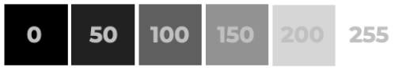

A partir desses números é possível medir a frequência que eles aparecem e organizar visualmente em um gráfico de histograma.

Portanto nosso histograma irá medir os valores de pixels de uma imagem.

02.a.Plotar o histograma de uma imagem

Neste exemplo vamos medir os tons de cinza da seguinte imagem: 

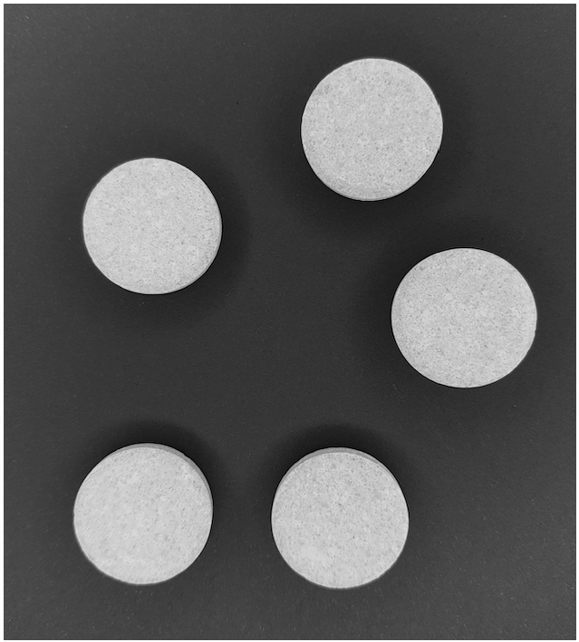

Para plotarmos um histograma, usaremos a biblioteca **Matplotlib** com o método ``hist( )`` e os seus parâmetros:

 - **Imagem:** imagem em tons de cinza.
    - Repare que é o método ``ravel( )`` que coloca todos os valores dos pixels em um vetor (como se fosse uma lista em Python).

  - **Quantidade de valores que podem ser representados:** 256 (pois a contagem vai de 0 para cor preta até 255 para cor branca).
  - **Intervalo de valores a ser plotado no eixo X:** de **0** até **255**.

.. code-block:: python
   :linenos:

   #Mostrando o histograma dos tons de cinza da imagem

   plt.hist(imagem_cinza.ravel(), 256, [0,255]);

O resultado irá variar de acordo com a sua imagem, em nosso exemplo da vitamina C é este:

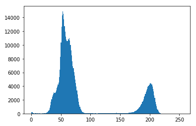

03.Filtros de ruído
====

03.a.O que são ruídos em uma imagem
-----

Ruídos em uma imagem são variações aleatórias dos valores dos pixels em uma imagem.

Ruídos podem ter diferentes origens como: poeira no ambiente (ou na lente da câmera), erro no processamento ou na compactação de imagens, etc..

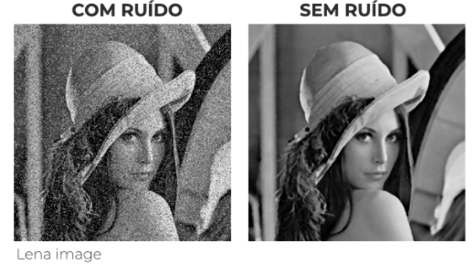

03.b.Filtros para ruído
----

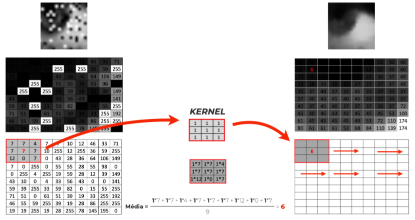

Existes diferentes tipos de filtros, ou seja *kernels* com diferentes valores. Cada filtro irá originar um efeito diferente.

Por hora, nosso objetivo e deixar a variação dos pixel "suavizada" para que não tenhamos "ruídos" e assim podermos focar em grandes estruturas/objetos da imagem.

Podemos sar o filtro (*kernel*) que multiplique os pixels pelos valores médios dos pixels vizinhos usando o método **`blur( )`** e os seus parâmetros:    

- **imagem:** imagem em tons de cinza.

- **tamanho do *kernel*:** neste caso usaremos um *kernel* de cinco linhas por cinco colunas:

  - Quanto maior o valor do *kernel* maior o efeito de filtro na imagem.
  - É recomendado *kernels* de tamanhos ímpares como: 1,3,5,7,9.

.. code-block:: python
   :linenos:

   #Usar o filtro blur() para suavizar a imagem
   imagem_cinza_suavizada = cv2.blur(imagem_cinza, (5,5))

   #Mostrar a imagem
   cv2_imshow(imagem_cinza_suavizada)

Em nosso exemplo veja a diferença de uma imagem para outra:

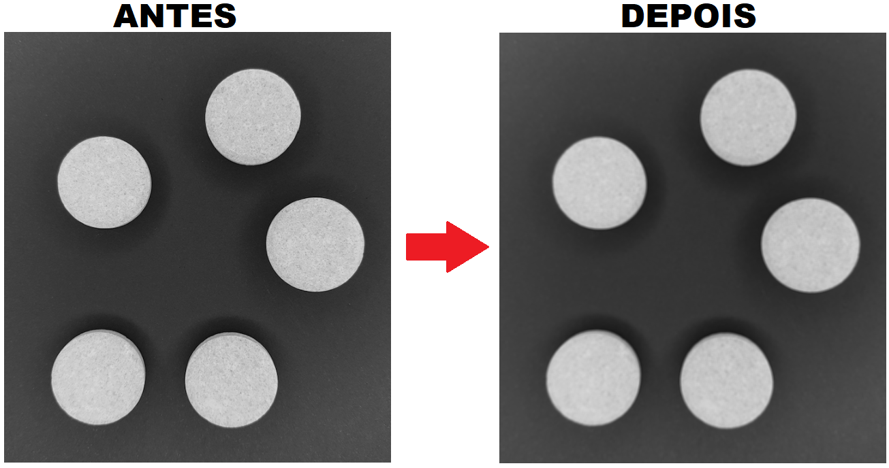

04.Detectar a borda do objeto
====

Detectar as bordas dos objetos é um passo muito importante em Visão Computacional. Com este procedimento, podemos entender o contorno do objeto e assim destacá-los do resto da imagem.

Para isso, usamos alguns filtros que realçam as bordas dos objetos dentro de uma imagem. Estes filtros usam o conceito de *kernel* visto anteriormente.

04.a.Filtro de Sobel
----

O filtro de Sobel realça as bordas dos objetos, ou seja, regiões da imagem onde há uma diferença de intensidade de valor nos pixels.
  - Para isso, ele usa um *kernel* com valores específicos.

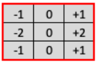

Para usarmos o filtro Sobel com o OpenCV, basta usarmos o método ``Sobel()`` e os seus parâmetros:    

- **imagem:** imagem em tons de cinza.
- **tipo de valor do pixel:** nesce caso será o **CV_U8** (valores entre 0-255 armazenados em 8 bytes). Obs: não se preocupe com esta parte mais técnica!.
- **realce na vertical:** se sim **1**, se não **0**.
- **realce na horizontal:** se sim **1**, se não **0**.
- **ksize:** tamanho do *kernel*.

.. code-block:: python
   :linenos:
   
   #Aplicando o filtro de Sobel na imagem
   imagem_cinza_suavizada_sobel = cv2.Sobel(imagem_cinza_suavizada, cv2.CV_8U, 1, 0, ksize=3)

   #Visualizando a imagem
   cv2_imshow(imagem_cinza_suavizada_sobel)

Em nosso exemplo esse é o resultado:

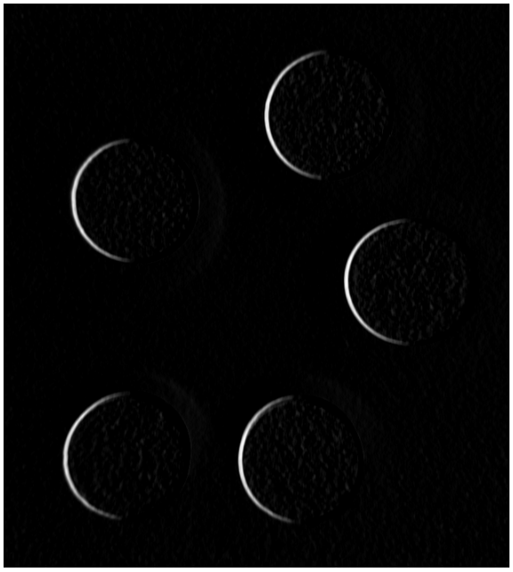

04.b.Detector de bordas *Canny*
----

É detector de bordas mais usado em OpenCV.
Usa ao mesmo tempo:     

  - **Filtro Gaussiano:** para suavizar a imagem.
  - **Filtro Sobel:** para detectar as bordas.

Para usarmos o detector de bordas *Canny*, utilizamod o método ``Canny( )`` e seus parâmetros:     
  - **imagem:** imagem em que aplicaremos o detector de bordas *Canny*.
  - **Limiar mínimo:** valor mínimo do pixel. Todos os pixels iguais ou menores que este valor não serão considerados como parte da borda.
  - **Limiar superior:** valor máximo do pixel. Todos os pixels com valores superiores a este valor serão considerados parte da borda.

.. code-block:: python
   :linenos:

   #Aplicar o detector de bordas Canny
   imagem_cinza_canny = cv2.Canny(imagem_cinza,180,210)

   #Visualizar a imagem
   cv2_imshow(imagem_cinza_canny)

Em nosso exemplo esse é o resultado:

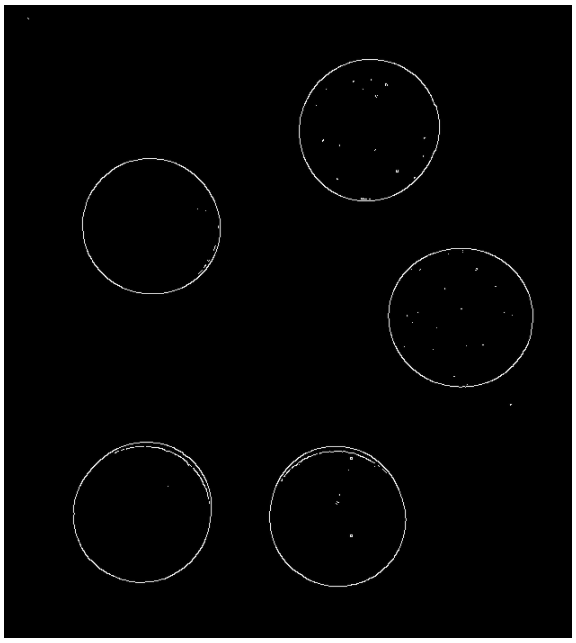

05.Segmentação do objeto
====

05.a.Segmentação binária
----

Segmentar um objeto na imagem basicamente é identificar o que é objeto e o que é o resto da imagem.

Existem diversas formas de segmentar objetos em uma imagem, uma forma muito utilizada é a **segmentação binária** que basicamente coloca o objeto em uma cor e o resto da imagem na cor oposta (preto e branco).

Para realizar uma segmentação binário usamos o método ``threshold( )`` e seus parâmetros: 

 - **imagem:** imagem em tons de cinza já suavizada por filtro.

 - **limiar/limite:** valor dos pixels que queremos segmentar a imagem.

 - **novo valor dos pixels:** novo valor dos pixels que estão acima do valor do limiar.
 - **tipo de binarização:**

    - ``cv2.THRESH_BINARY:`` objeto de interesse na cor branaca.
    - ``cv2.THRESH_BINARY_INV:`` objeto de interesse na cor preta.

.. code-block:: python
   :linenos:

   #Aplicar a segmentação binária
   ret, imagem_binarizada = cv2.threshold(imagem_cinza_suavizada, 100, 255, cv2.THRESH_BINARY)

   #Visualizar imagem
   cv2_imshow(imagem_binarizada)

Em nosso exemplo este é o resultado:

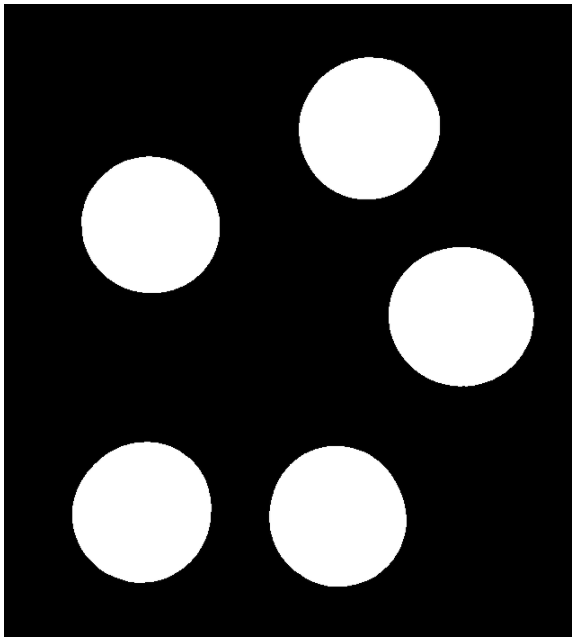

05.b.Realizar contornos nos objetos
----

Realizar contornos é basicamente traçar uma linha em todos os pontos de diviza entre preto (0) e branco (255) na imagem binarizada.

Contorno é muito útil em Visão Computacional, pois com eles podemos fazer processos importantes como destaque e contagem de objetos na imagem.

Para realizarmos os contornos do objeto de interessa usamos o método ``findContours( )`` e seus parâmetros:     

    - **imagem:** imagem binarizada.
    - **mode:** modo de recuperar o contorno realizado.
    - ``method:`` método de realizar o contorno.

.. code-block:: python
   :linenos:

   #Aplicando contornos
   contornos, hierarquias = cv2.findContours(image=imagem_binarizada,
                                       mode=cv2.RETR_TREE,
                                       method=cv2.CHAIN_APPROX_NONE)

   #Realizando uma cópia da imagem original
   copia_imagem_original = imagem_original.copy()

   #Desenhar contornos
   cv2.drawContours(image=copia_imagem_original,
                 contours=contornos,
                 contourIdx=-1,
                 color=(0, 255, 0),
                 thickness=2,
                 lineType=cv2.LINE_AA)

   #Visulizar imagem
   cv2_imshow(copia_imagem_original)

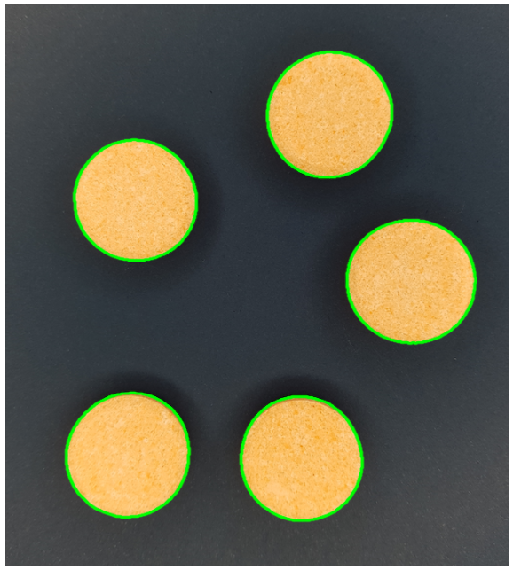

.. note::

   Caso deseje contar a quantidade de contornos basta utilizar o comando ``len()``

   .. code-block:: python
      :linenos:

      len(contornos)

   O resultado será o número de contornos na imagem.
