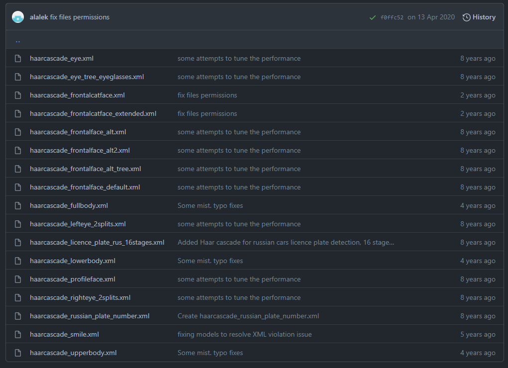
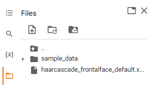
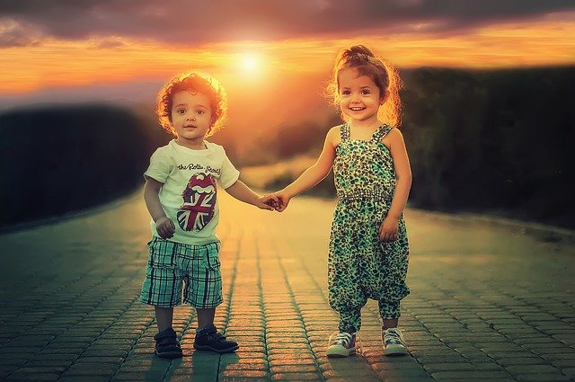
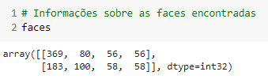
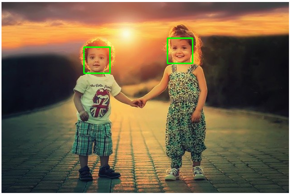

Detecção de objetos com Haar Cascade
****

Haar Cascade é um modelo de inteligência artificial para detecção de objetos em imagens que está disponibilizado nesse repositório no GitHub:

https://github.com/opencv/opencv/tree/master/data/haarcascades

Repare que no repositório existem diversos modelos cada um treinado para identificar diferentes objetos, como parte frontal do rosto, sorrisos, parte de cima do corpo, olho direito, etc.

Para utilizar este modelo Haar Cascade precisa fazer o download do modelo desejado e colocar na aba lateral do Google Collaboratory

No nosso exemplo iremos utilizar a foto abaixo e o modelo ``haarcascade_frontalface_default.xml`` para identificar as faces da imagem.

Para detectar faces, usaremos o método ``detectMultiScale`` e os seus parâmetros:    
  
  - **imagem_cinza:** imagem em tons de cinza.
    
  - **scaleFactor:** escala da imagem para trablharmos a detecção de faces (testes sempre valores maiores do que **1.0**.
  
  - **minNeighbors:** quantidade mínima em que o algoritmo classificou a região da imagem como sendo uma face.
  
  - **minSize:** tamanho mínimo da face para ser aceita na detecção.

.. code-block:: python
   :linenos:

   #Importar a biblioteca necessária
   import cv2
   from google.colab.patches import cv2_imshow

   #Importando a imagem
   imagem_original = cv2.imread("/content/criancas.jpg")

   #Converter a imagem em escala de cinza
   imagem_cinza = cv2.cvtColor(imagem_original, cv2.COLOR_BGR2GRAY)

   #Importar o arquivo Haar Cascade
   haar_cascade_face = cv2.CascadeClassifier('/content/haarcascade_frontalface_default.xml')
   
   #Detectando as faces
   faces = haar_cascade_face.detectMultiScale(imagem_cinza,
                                           scaleFactor=1.09,
                                           minNeighbors=5,
                                           minSize=(25,25))   

Basicamente, para cada face encontrada temos uma **lista** com quatro elementos indicando cada posição do retângulo (região da imagem) em que está as faces detectadas:

``[posição inicial X, posição inicial Y, largura, altura]``   
   

  
Para finalizar vamos desenhar um retângulo em cada face encontrada usando o método ``rectangle( )`` do OpenCV e seus parâmetros: 
  - **imagem:** nome da imagem original (colorida).   

  - **posição inicial X e Y (canto superior esquedo do retângulo:** (x,y)

  - **posição final X e Y (canto inferior direito do retângulo:** (x,y)

  - **cor:** cor da linha

  - **grossura:** grossura da linha

.. code-block:: python
   :linenos:

   #Desenhar o retângulo
   for (x,y,largura,altura) in faces:
                cv2.rectangle(imagem_original,
                (x,y),
                (x+largura, y+altura),
                (0,255,0),
                2)
  
   #Visualizar imagem
   cv2_imshow(imagem_original)

