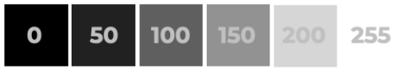

Processamento de imagem 
****

01.Bibliotecas Necessárias
====

Para trabalhar com visão computacional utilizamos uma biblioteca em Python chamada de **OpenCV** (também chamada de cv2). 
Uma função importante que também precisa ser importada é a ``cv2_imshow``, este comando nos permite mostrar a imagem que estamos trabalhando. 

.. code-block:: python
   :linenos:

   #Importar OpenCV
   import cv2

   #Importar comando cv2_imshow
   from google.colab.patches import cv2_imshow

01.a.Importar uma imagem
-----

Após realizar o upload de uma imagem no Google Collaboratory podemos importá-la para nosso código e começar a trabalhar com ela, igual fazemos com os Datasets.

Para importar uma imagem usando a biblioteca OpenCV usamos o método ``imread()``

.. code-block:: python
   :linenos:

   #Importar a imagem
   imagem_ponte = cv2.imread("/content/san_francisco.jpg")

01.b.Mostrar a imagem
-----

Para mostrar a imagem atribuída a variável ``imagem_ponte``, usamos o método ``cv2_imshow()``

.. code-block:: python
   :linenos:

   #Mostrar a imagem
   cv2_imshow(imagem_ponte)

Este será o output do código:

.. image:: images/visao_comp/imagem_ponte.png
   :align: center
   :width: 550

Que é justamente a imagem que fizemos o upload. 

02.O que é uma imagem
====

02.a.Pixels
----

A menor parte de uma imagem é chamada de *pixel* e cada imagem é formada por muitos *pixels*.

02.b.Cores
-----

As cores de um *pixel* estão no formato **RGB**, ou seja, a cor de cada **pixel** é uma mistura de três cores **Vermelho**, **Verde**,**Azul** (na sigla em inglês: **RGB** - **R**ed,**G**reen,**B**lue).

.. note::

   Por padrão o OpenCV usa as cores na ordem contrária, ou seja, BGR (azul, verde, vermelho).

Em cada *pixel*, cada uma destas três cores correspondem a um valor numérico que vai de 0 até 255, sendo:
  - **0**: ausência da cor.
  - **255**: valor máximo da cor.

.. note::

   Caso você queira descobrir qual o valor RGB de uma cor pode utilizar esse link de um selecionador de cor RGB:

   https://www.w3schools.com/colors/colors_rgb.asp

Cada cor é chamada de **canal**, portanto nesta imagem temos um total de 3 canais, um para cada cor. 
Caso a imagem esteja em preto e branco ela terá apenas um canal 

02.c.Formato de uma imagem
----

O formato de uma imagem é composto por:

- Altura (em quantidade de pixels).

- Largura (em quantidade de pixels).

- Canais (quantidade de canais):

  - Imagem em **RGB**: 3 canais (um para cada cor).

  - Imagem em preto e branco: 1 canal.

Para visualizarmos o formato de uma imagem usamos a propriedade ``shape``:

.. code-block:: python
   :linenos:

   #Mostrar o formato da imagem
   imagem_ponte.shape

O output será justamente a altura, largura e a quantidade de canais, respectivamente.

.. code-block:: python
   :linenos:

   (420, 640, 3) 

Caso queira salvar em variáveis e exibir com o comando ``print()`` pode fazer assim:

.. code-block:: python
   :linenos:

   #Salvando em variáveis
   altura, largura, quantidade_de_canais = imagem_ponte.shape

   #Exibindo com o comando print()
   print("Altura: ", altura)
   print("Largura: ", largura)
   print("Quantidade de canais: ", quantidade_de_canais)

Neste exemplo o output será esse: 

02.d.Transformar uma imagem para tons de cinza
-----

Ao transformarmos uma imagem colorida para tons de cinza, esta imagem passa a ter apenas um canal de cor, que é justa mente vários tons de cinza que vão desde o valor **0** para a cor preta até **255** para a cor branca. 

Para **converter** uma imagem colorida para uma imagem em tons de cinza, usamos o método **`cvtColor`**, ou seja, "converter para cor". Também usamos os seguintes parâmetros:

- **nome da imagem:** ``pedaco_imagem_ponte``

- **conversão a realizar:** ``cv2.COLOR_BGR2GRAY``
(ou seja, converter de RGB para tons de cinza)

.. code-block:: python
   :linenos:

   #Converter a imagem para cinza
   imagem_ponte_cinza = cv2.cvtColor(pedaco_imagem_ponte, cv2.COLOR_BGR2GRAY)

   #Mostrar a imagem em tons de cinza
   cv2_imshow(imagem_ponte_cinza)

A saída do código será justamente a imagem em tons de cinza:

02.d.I.Matriz
++++

O computador basicamente é uma máquina de fazer contas com números, assim,  ele entende uma imagem como uma matriz.
- Na matemática, uma matriz nada mais é do que uma forma de armazernarmos valores em linhas e colunas.

Como a imagem está em tons de cinza, cada elemento desta matriz tem o seu valor numérico correspontente ao tom de cinza (de 0 até 255).

Agora, vamos observar a imagem, como o computador a observa, ou seja, um conjunto de números organizado em uma matriz.

03.Operações básicas com uma imagem
====

**Dimensões de uma imagem**

.. code-block:: python
   :linenos:

   #Imprimir altura e largura
   print("Altura: ", altura)
   print("Largura: ", largura)

O resultado será esse:

.. code-block:: python
   :linenos:

   Altura: 426
   Largura: 640

**Centro da imagem**

.. code-block:: python
   :linenos:

   #Calcular o centro de uma imagem
   (centro_X, centro_Y) = (largura//2,altura//2)

   #Imprimir os resultados

   print("Tamanho do eixo X: {}".format(largura))
   print("Centro do eixo X: {}".format(centro_X))
   print("---------------------")
   print("Tamanho do eixo Y: {}".format(altura))
   print("Centro do eixo Y: {}".format(centro_Y))

O resultado será esse:

03.a.Cortar uma imagem
----

Vamos selecionar uma região da imagem, que é justamente o canto superior esquedo. Para isso temos que informar o início e o fim desta região da imagem.
- **início**: x=0 e y=0.
- **fim**: x=centro_x e y=centro_y.

Agora vamos pegar esta região e salvar em uma variável **`canto_superior_esquerdo`**:

.. code-block:: python
   :linenos:

   #Selecionar o canto superior esquerdo da imagem
   canto_superior_esquerdo = imagem_ponte[0:centro_X, 0:centro_Y]

   #Mostrar o canto superior esquerdo da imagem
   cv2_imshow(canto_superior_esquerdo)

O resultado será esse:

04.Desenhar em uma imagem
====

Podemos fazer diferentes desenhos em uma imagem: linhas, retângulos, quadrados, círculos e etc.

Antes de tudo, vamos defini a cor que terá o traçado destes desenhos:

.. code-block:: python
   :linenos:

   #Definir cor
   cor_verde = (0,255,0)

04.a.Linha
----

Para desenhar uma linha na imagem, usamos o método ``line( )`` e os seguintes parâmetros:
- **nome da imagem em que desenharemos:** imagem_ponte
- **local do início da linha:** (x,y)
- **local do fim da linha:** (x,y)
- **cor da linha:** **`cor_verde`**
- **grossura da linha:** 3

.. code-block:: python
   :linenos:

   #Desenhar uma linha na imagem
   imagem_ponte_com_linhha = cv2.line(imagem_ponte, (0,0), (250,250), cor_verde, 3)

   #Visualizar imagem desenhada
   cv2_imshow(imagem_ponte_com_linha)

O resultado será esse:

04.b.Retângulo
----

Para desenharmos um retângulo na imagem, usamos o método ``rectangle( )`` e os seguintes parâmetros:

- **nome da imagem a ser desenhada:** imagem_ponte
- **ponta superior esquerda do retângulo:** (x,y)
- **ponta inferior direita do retângulo:** (x,y)
- **cor da linha:** **`cor_verde`**
- **grossura da linha:** 3
  - Obs: caso o valor seja "-1", o retângulo ficará preenchido.

.. code-block:: python
   :linenos:

   #Desenhar um retângulo na imagem
   imagem_ponte_com_retangulo = cv2.rectangle(imagem_ponte,(100,100), (200,200), cor_verde,3)

   #Visualizar imagem desenhada
   cv2_imshow(imagem_ponte_com_retangulo)

O resultado será esse:

04.c.Círculo
----

Para desenharmos um círculo na imagem, usamos o método ``circle( )`v, com os seguintes parâmetros:

- **nome da imagem a ser desenhada:** imagem_ponte
- **centro do círculo:** (x,y)
- **raio do círculo:** 80
- **cor do círculo:** **`cor_verde`**
- **grossura da linha:** 3
  - Caso o valor seja "-1", o círculo será preenchido.

.. code-block:: python
   :linenos:

   #Desenhar um ciruclo na imagem
   imagem_ponte_com_circulo = cv2.circle(imagem_ponte, (400,200), 80, cor_verde, 3)

   #Visualizar imagem desenhada
   cv2_imshow(imagem_ponte_com_circulo) 

O resultado será esse:

04.d.Escrever um texto na imagem
----

Para escrever um texto em uma imagem, usamos o método ``putText( )`` com os seguintes parâmetros:

- **nome da imagem a ser usada:**
- **texto:** texto a ser escrito na imagem.
- **posicao:** posição (x,y) na imagem em que ficará o texto.
- **fontFace:** fonte da letra usada no texto.
- **fontScale:** tamanho da fonte da letra.
- **color:** cor do texto.

.. code-block:: python
   :linenos:

   #Salvando os parâmetros
   texto = "San Francisco"
   posicao = (30,100)
   cor_azul = (255,0,0)

   #Escrever texto na imagem
   imagem_ponte_com_texto = cv2.putText(imagem_ponte,
                                     texto,
                                     posicao,
                                     fontFace = cv2.FONT_HERSHEY_PLAIN,
                                     fontScale=2,
                                     color=cor_azul)

   #Visualizar imagem
   cv2_imshow(imagem_ponte_com_texto)

O resultado será esse:

05.Salvando uma imagem
====

Para salvar uma imagem, usamos o método ``imwrite( )`` e os seguintes parâmetros:

-  **nome do arquivo/imagem que será criado:** "imagem_ponte_texto.jpg"

- **nome da imagem:** ``imagem_ponte``

.. code-block:: python
   :linenos:

   #Gravar uma imagem nova
   cv2.imwrite("imagem_ponte_texto.jpg", imagem_ponte)

A saída desse código será ``True`` caso tenha dado certo ou ``False`` caso tenha dado errado.
Depois de rodar esse código repare que o arquivo já aparece na lateral do Google Collaboratory

