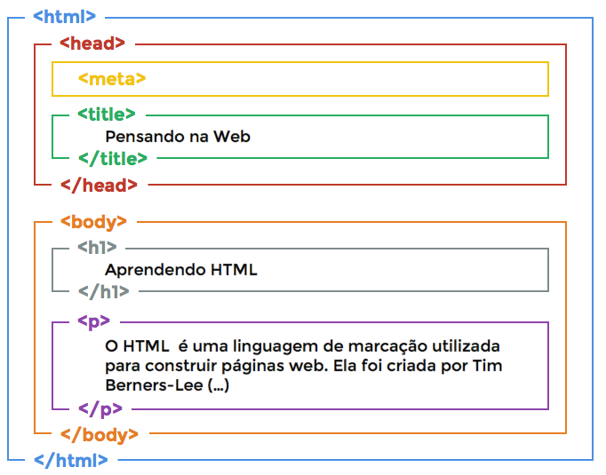
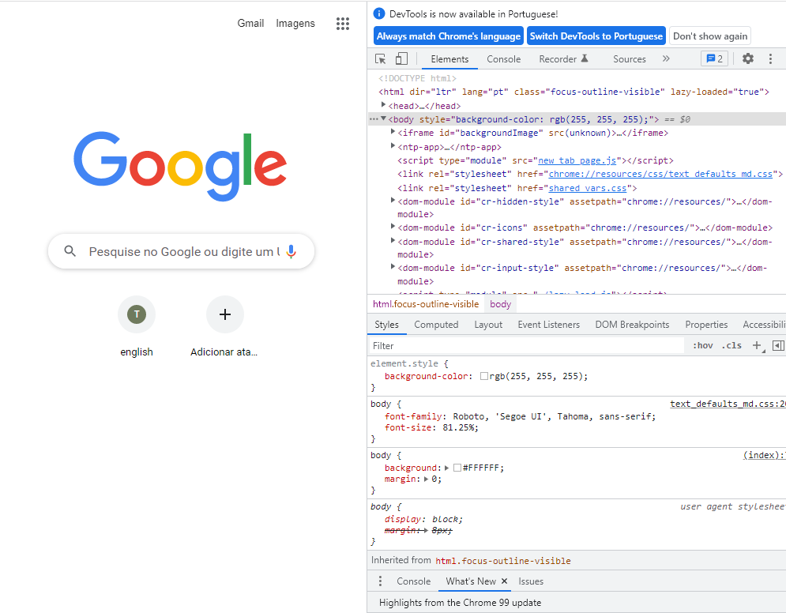
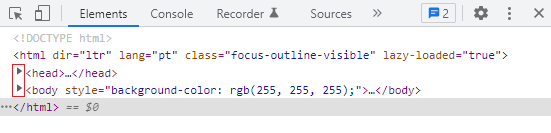
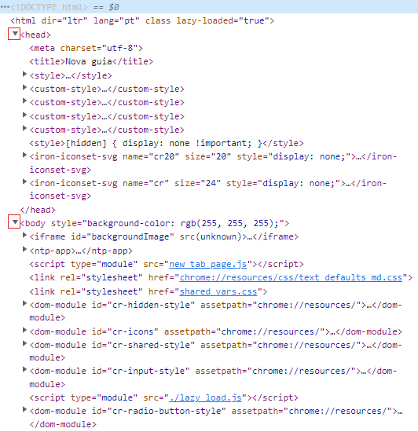
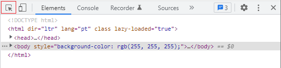
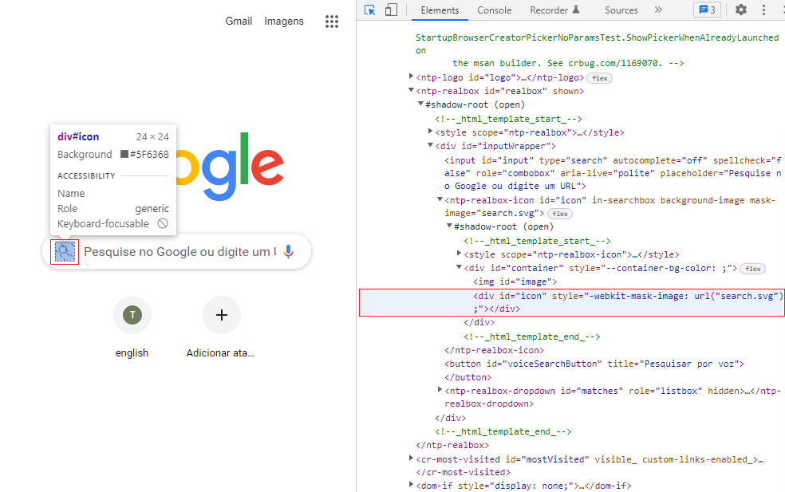

HTML
****

01.O que é HTML
====

HTML é uma sigla para *Hypertext Markup Language*, sua tradução é linguagem de marcação por hipertexto.
Hipertexto é uma linguagem separada por tags, como por exemplo na imagem abaixo, cada cor representa uma tag (<html>, <head>, <body>, etc) e o HTML é represetado pela estrutura a seguir:

É uma forma parecida com o markdown do Google Colaboratory ou do GitHub, que serve para estruturar nossa página na web.

.. note::

   HTML **não** é uma linguagem de programação, HTML é uma linguagem de marcação.
   A diferença é que linguagem de programação serve para você realizar e executar programas, enquanto marcação é para realizar um posicionamento de itens que conversão entre si.

02.Como verificar o HTML de uma página Web
====

Toda página disponível na Web possuí um HTML, para verificar qual o HTML da página que você está navegando basta apertar o botão **F12**.

Se analisar bem a imagem acima irá reconhecer as estruturas mencionadas no tópico anterior, como <html>, <head>, <body>, etc.

Repare que é possível interagir com o HTML da página.

02.a.Maximizar e Minimizar
----

Algumas estruturas HTML possuem setas que permitem minimizar ou maximizar seu conteúdo, basta clicar neles.

02.b.Identificar itens no HTML
----

Todo elemento que existe em uma página de Web está presente na estrutura do HTML dela.
Para identificar itens no HTML é só clicar no botão de seta do mouse no canto superior esquerdo.

Depois de selecionar o botão, basta percorrer a página até selecionar o objeto que você quer identificar no página.

Repare que além dele trazer informações sobre aquele botão (lado esquerdo) ele também trás qual a localização e a forma de escrever (lado direito), isso significa que todos os elementos são rastraveáis.

Neste exemplo estamos buscando elementos de uma nova guia do Google Chrome, porém com qualquer outra página o funcionamento é igual.
