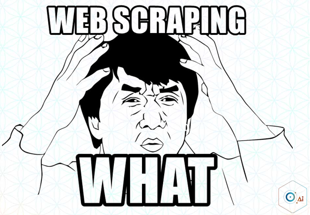
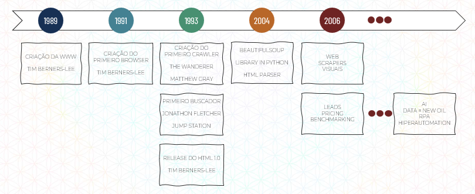
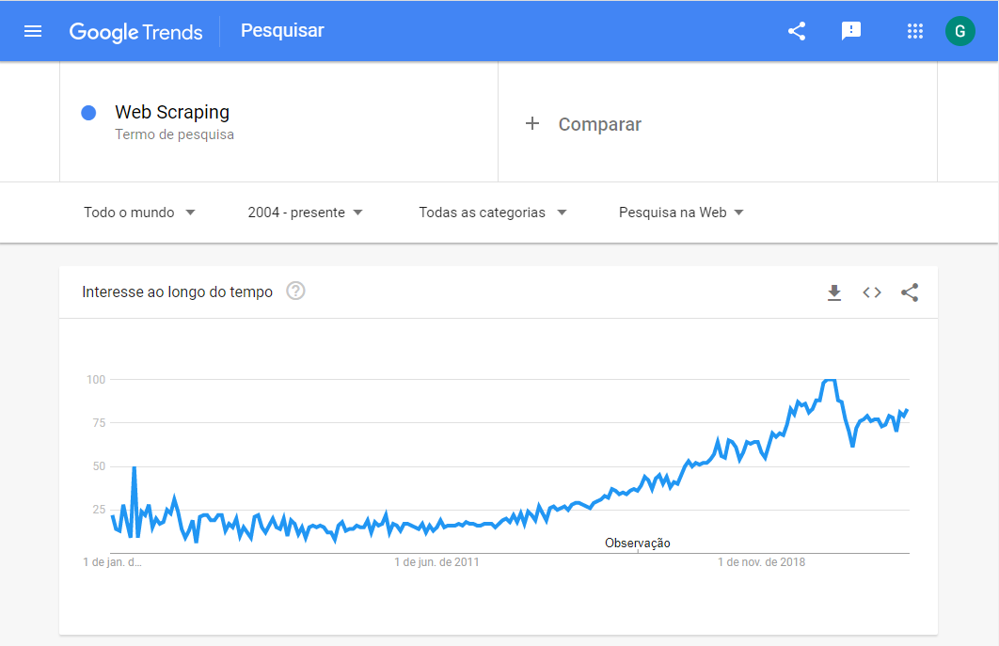
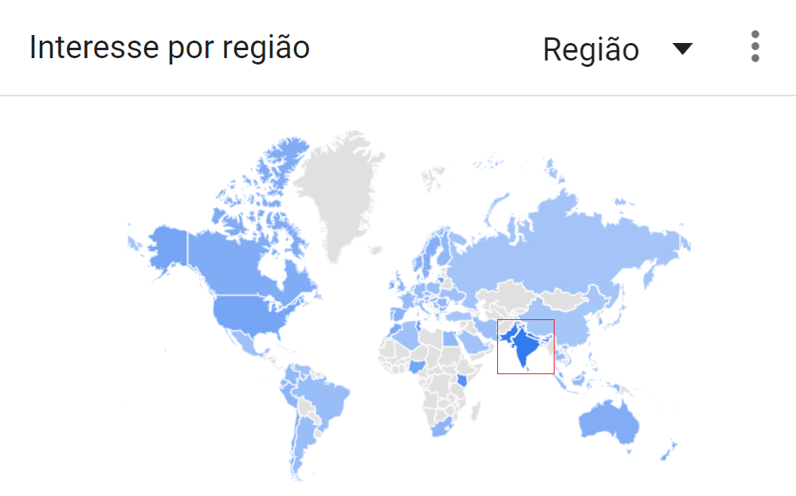

Introdução
****

01.O que é Web Scraping
====

Web Scraping pode ser chamada de várias formas como Crawling, Spiders, Harvesting, Data Extraction. Nada mais é do que uma técnica de raspagem de dados na rede, ou seja, é uma forma de coletar informações em páginas da Web.

Como vimos anteriormente existe a biblioteca pyautogui que nos permite automatizar cliques do mouse, no teclado, assim criando robôs de RPA.

Graças a estrutura que o HTML nos disponibiliza (assunto que veremos mais a frente), é possível acessar atráves de outras biblitecas Python os elementos da Web e raspar as informações que estão lá, como nome do site, textos presentes nas páginas, número de seguidores, etc. 
Ou utilizar para executar ações como fazer um login, clicar em algum botão assim automatizando tarefas, por isso o Web Scraping é uma outra vertente de RPA porém na Web.

02.Histórico do Web Scraping
====

Como é possível verificar na linha do tempo acima o Web Scraping não é um conceito novo, porém muito pouco explorado. 

Em 1989 foi criado o World Wide Web (www), pelo Tim Berners, em um projeto no CERN, o centro de pesquisa europeu.
A ideia inicial da internet é que a princípio fosse uma rede acadêmica de compartilhamento entre professores e alunos com potencial de conectar o mundo, alguns anos depois e foi exatamente o que aconteceu, afinal, cá estamos nós.
Em 1991, mais uma vez pelo Tim Berners, foi criado o primeiro browser. 

.. note:: 

   Browser é um navegador de web que habilita seus usuários a interagirem com documentos HTML, por exemplo:
   Internet Explorer, Chrome, Firefox, DuckDuckGo, etc.

Como era necessário ter uma estrutura para navegar na internet (botões, caixas de texto, abas, etc), Tim Bernes criou a linguagem HTML, que até hoje é utilizada. Por ter basicamente criado toda a estrutura que utilizamos até hoje ele é conhecido como pai da Internet.

Tambem foi criado o primeiro buscador chamado Jump Station (como Google, Buscapé).

Assim como outras criações importantes, em 1993 nós temos a criação do **The Wanderer**, o **primeiro crawler** de Web que tinha o objetivo de medir o tamanho da Web na época (quantas pessoas estavam acessando, quem estava acessando, de onde estava acessando, etc).
Como muitas pessoas já estavam conectadas na Web e os hardwares para armazenamento de dados não eram tão bons o The Wanderer não foi para frente.

Depois durante 1994-2003 o Web Scraping foi deixado de lado pois poucas pessoas estavam preocupadas em coletar dados. Estavam mais preocupadas em lançar seus sites, produtos e se tornar uma marca visivelmente forte na Web.

.. image:: images/web_scrap/BeautifulSoup.png
   :align: center
   :width: 450

Até então que em 2004 foi criado a BeautifulSoup, uma biblioteca em Python que faz uma varredura em todo o HTML.

.. note::

   Para quem tiver interesse, segue o link da biblioteca BeautifulSoup:

   https://www.crummy.com/software/BeautifulSoup/bs4/doc/

Em 2006 essas ferramentas de Scraping começaram a crescer e explodir no mercado, então começaram a aparecer softwares de Web Scraping e as empresas começaram a entender que  podem extrair informações poderosas para se tornarem mais competitivas no mercado a partir da coleta desses dados. 

E até os dias atuais Web Scraping é muito importante e está muito ligado com a coleta de dados para RPA, Data = New Oil, AI, Hiperautomation.

03.Google Trends
====

É muito bacana sempre trazer a ferrmenta do Google Trends par entender como este assunto é relevante no mundo.
Ao pesquisarmos o termo Web Scraping podemos verificar que desde 2004 até os dias atuais tivemos uma ascenção no número de pesquisas por dia. 

E essas pesquisas ocorrem principalmente no eixo tecnológico do mundo, Índia, Paquistão, Bangladesh, etc.

   

04.Bloqueios
====

Web Scraping é um conceito que precisa ser utilizado com *parcimônia* (menos é melhor).

Hoje em dia os sites colocam bloqueios para Web Scraping, pois a maneira mais fácil de você fazer um site cair é com uma alta taxa de acesso e solicitações.

Imagine que você desenvolve um robô de Web Scraping que entra no site do governo e faz pesquisa de meio segundo em meio segundo, de diversos ip's, isso acaba derrumando o sistema.

Então as empresas começaram a bloquear certos comportamentos de scraping para que não caiam, não haja invasão, etc. 
É importante ter esses bloqueios no site para segurança, são eles:

1. Monitorar os registros e padrões de tráfego
2. Limite de acesso para atividades incomuns
3. Solicitar registro e login para acesso
4. Uso de Captchas
5. Exibição do conteúdo de texto como imagem
6. Não expor o conjnto de dados completo
7. Não expor quais APIs utiliza, ou exponr e monetizar o acesso,
8. Alteração frequente do HTML
9. Uso exijido de cookies
