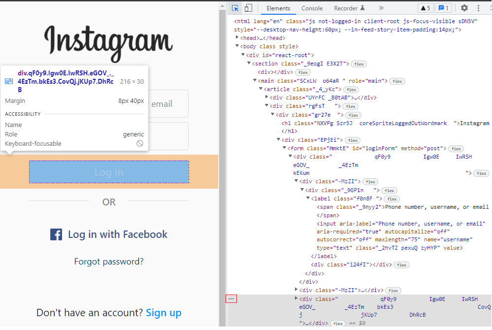
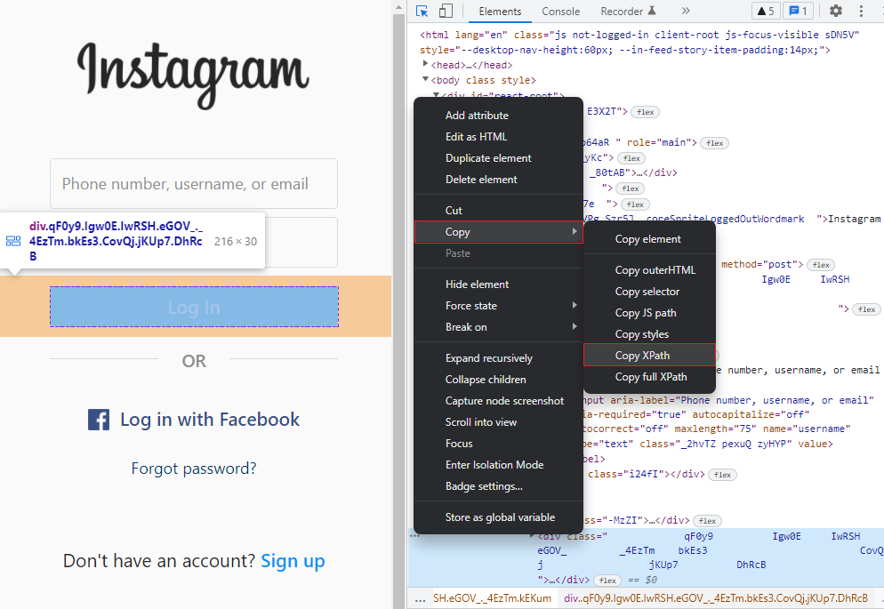
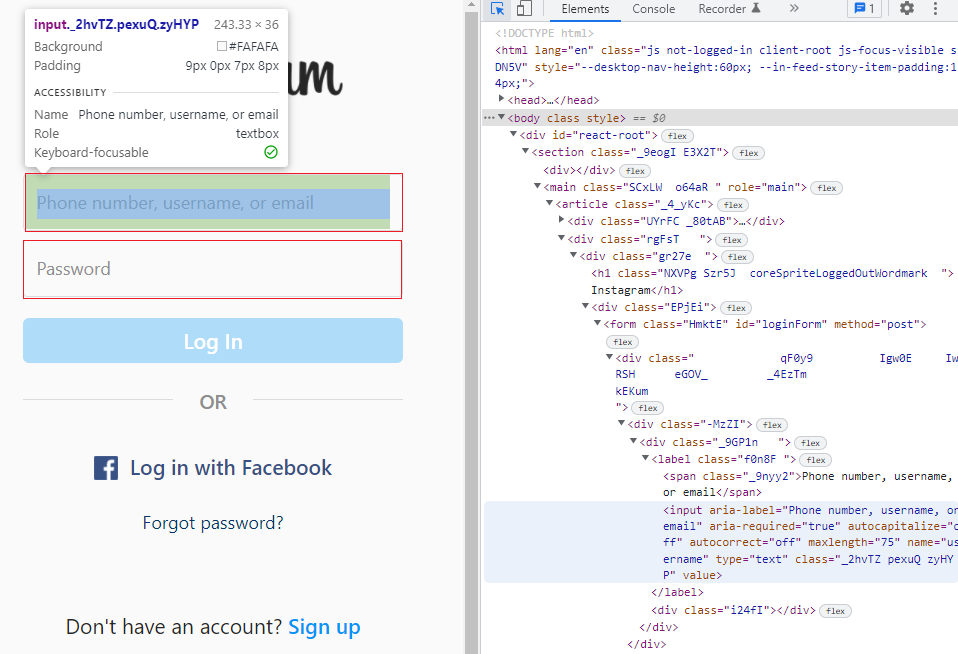

Web Scraping na prática 
****

01. Let's code
====

Para realizarmos a atividade de Web Scraping na prática nós iremos trabalhar no Google Collaboratory utilziando a biblioteca selenium:

https://selenium-python.readthedocs.io/

A biblioteca selenium é uma biblioteca para raspagem de dados realizar diversas operações de automação de scraping na Web.

Nós vamos trabalhar principalmente com os comandos:

01.a.Encontrar elementos na tela:
----

Com o comando ``find_elements`` é possível coletar algum elemento presente na tela, basta apenas selecionar por onde você quer encontrar esse elemento. 

Por exemplo, ao clicar F12 em uma tela e encontrar um elemento que deseja copiar o caminho, basta clicar nos três pontinhos no canto esquerdo do HTML.

Depois ir em copy e selecionar o caminho desejado. 

.. note:: 

   Na documentação da biblioteca selenium existe a explicação de qual forma de caminho é melhor para sua aplicação, mas por via geral sempre que utilizar o XPath é mais garantido.

Agora que já temos o elemento copiado basta utilizarmos no código:

.. code-block:: python
   :linenos:

   login = driver.find_element_by_xpath("//*[@id="loginForm"]/div/div[3]")

Dessa maneira já é possível localizar elementos presentes na página da Web

01.b.Dar o comando de clicar
----

Certo, agora que já aprendemos a localizar os elementos desejados na página da Web é importante aprender a tomar ações a partir dele. 
Uma das possíveis ações é dar o comando de clicar com o mouse, para isso basta utilizar o comando ``click()`` logo depois da localização do elemento desejado.

.. code-block:: python
   :linenos:

   login = driver.find_element_by_xpath("//*[@id="loginForm"]/div/div[3]").click()

01.c.Copiar texto de algum elemento
----

Imagine que você queira extrair ou coletar algum texto presente em algum elemento. 
Para isso basta utilziar o comando ``text()``

.. code-block:: python
   :linenos:

   texto_desejado = driver.find_element_by_xpath("//*[@id="loginForm"]/div/div[5]/button/span[2]").text()

01.d.Enviar teclas para o elemento
----

Imagine que você está automatizando um robô de scraping em uma página que é necessário fazer login. 

Para realizar o login é preciso enviar digitar suas credenciais para as caixas de "username" e "password".

Justamente para digitar essas credenciais nós temos o comando ``send_keys()``

.. code-block:: python
   :linenos:

   nome_usuario = colocar_seu_login

   username = driver.find_element_by_xpath("//*[@id="loginForm"]/div/div[1]/div/label/input")

   username.send_keys(nome_usuario)
